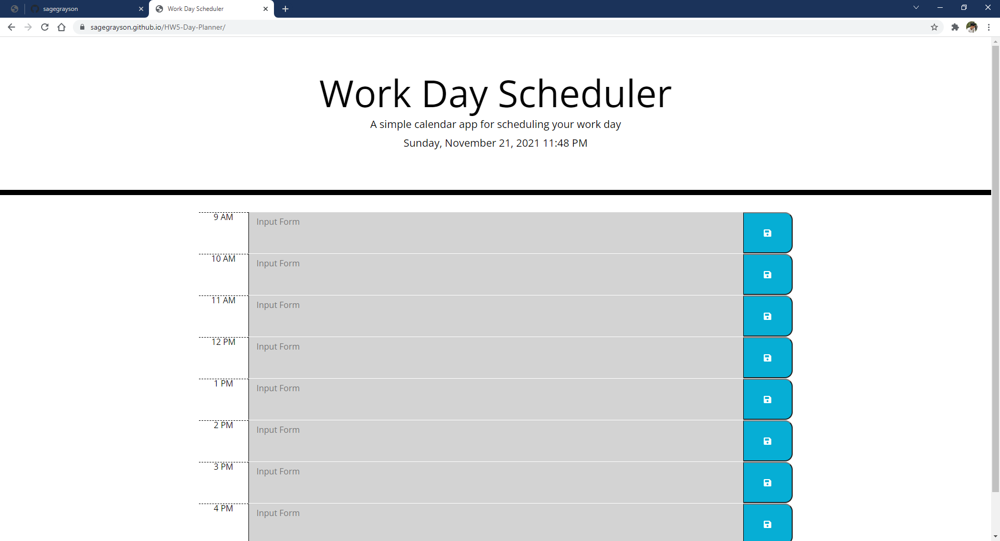

# HW5 Day Planner

## Description

This is a js based day planner which makes use of local storage and current time values.

[Link](https://sagegrayson.github.io/HW5-Day-Planner/)

## Contents

-   [Usage](#usage)
-   [Contributors](#contributors)
-   [License](#license)
-   [Contact](#contact)

## Usage

Using the deployed project, type into the text boxes for each hour and save. If the page is refreshed, the current values will remain. The display changes depending on the time of day.

## License

The project uses the [Do WTF You Want To](http://www.wtfpl.net/) license.

## Contact

Link to my github: [sagegrayson](https://github.com/sagegrayson)

If you'd like to contact me, email me at [skaseyg@gmail.com](mailto:skaseyg@gmail.com)
